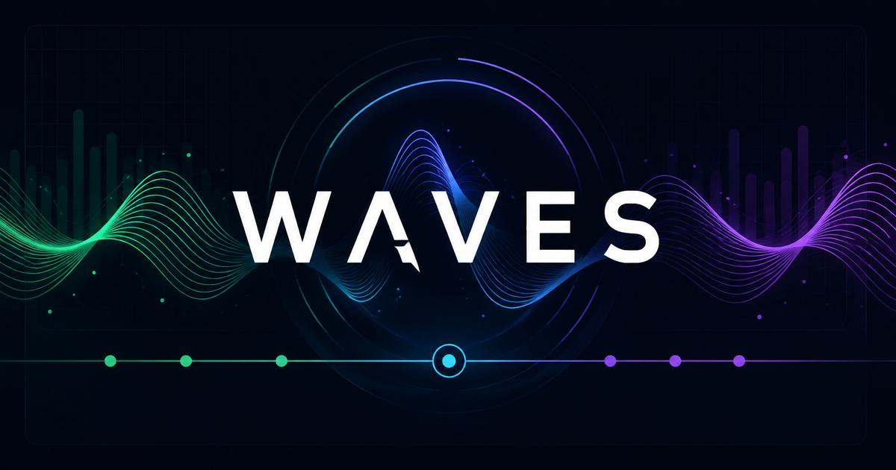

# Waves

[English](README.md) | [Português (Brasil)](README.pt-BR.md)



Waves is a private, mobile-first control panel for a Discord music bot. It keeps
the queue, player state, listening history, and operational status in one
self-hosted web application while the Discord process handles only voice and
other ephemeral runtime resources.

> [!IMPORTANT]
> Waves has no built-in deployment access control. Guest sessions and Discord
> account linking identify users inside the application, but they do not protect
> the panel from unauthorized visitors. Do not expose Waves directly to the
> public internet; put it behind HTTPS and an authentication-aware reverse proxy,
> VPN, or zero-trust gateway.

## Features

- Persistent, mobile-first collaborative queue backed by SQLite.
- Spotify track search and metadata.
- YouTube Music audio resolution and playback through Discord voice.
- Web controls for play state, pause, resume, skip, volume, queue ordering, and
  removal/restoration.
- Discord commands: `/play`, `/queue`, `/login`, `/join`, `/leave`, `/pause`,
  `/resume`, `/skip`, and `/volume`.
- Guest sessions plus one-time Discord account linking by private link and QR
  code.
- Automatic queue progression and autoplay suggestions from Last.fm and YouTube
  Music, resolved back to Spotify metadata.
- Real-time browser synchronization, listening history, and playback diagnostics.
- Separate web, bot, and voice status reporting, structured logs, health checks,
  and SQLite backups.

## Architecture

```text
apps/
  web/       Nuxt 4 full-stack app, Nitro API, domain rules, and SQLite access
  bot/       discord.js process, voice connections, players, and streams
packages/
  shared/    shared Zod schemas and TypeScript types
```

Nuxt is the source of truth for the queue and player. The bot communicates only
with the protected internal API and never opens SQLite directly. Spotify is used
for search and metadata; YouTube Music through `youtubei.js` is the only audio
source. Runtime voice connections, audio players, subscriptions, and streams
remain ephemeral inside the bot.

## Requirements

### Docker self-hosting

- Docker Engine with Docker Compose v2.
- A Discord application installed in one server.
- Spotify application credentials.
- A Last.fm API key is optional but recommended for richer autoplay suggestions.
- Network access to Discord, Spotify, Last.fm when configured, and YouTube Music.

The image already includes FFmpeg and the required Node.js runtime.

### Local development

- Node.js 25.5.0 or newer, as declared in `.node-version` and `.mise.toml`.
- pnpm 11.5.2, as declared by `packageManager`.
- FFmpeg available on `PATH` with Opus support.
- The same provider credentials and network access required for self-hosting.

## Provider setup

### Discord

1. Create an application and bot in the Discord Developer Portal.
2. Copy the bot token and application ID.
3. Enable installation for the target server with the `bot` and
   `applications.commands` scopes. Grant at least View Channels, Connect, and
   Speak in the voice channels Waves will use.
4. Enable Developer Mode in Discord, copy the target server ID, and store all
   three values in `.env`.

Waves only requests the `Guilds` and `GuildVoiceStates` gateway intents; it does
not require privileged message-content or member intents. Commands are registered
for the configured server at startup, so updates normally appear immediately.

### Spotify

Create an application in the Spotify Developer Dashboard and copy its client ID
and client secret. Waves uses the client-credentials flow on the server; these
values must never be exposed to the browser or committed to Git.

### Last.fm

Create a Last.fm API account and set `LASTFM_API_KEY` to enable the Last.fm
autoplay provider. If it is omitted, Waves can still try the YouTube Music
recommendation provider.

## Environment configuration

Copy the example file and edit the local copy:

```bash
cp .env.example .env
```

PowerShell equivalent:

```powershell
Copy-Item .env.example .env
```

The minimum values to review are:

| Variable                | Required    | Purpose                                                                   |
| ----------------------- | ----------- | ------------------------------------------------------------------------- |
| `DISCORD_TOKEN`         | Yes         | Discord bot token.                                                        |
| `DISCORD_CLIENT_ID`     | Yes         | Discord application ID.                                                   |
| `DISCORD_GUILD_ID`      | Yes         | Server where guild commands are registered.                               |
| `SPOTIFY_CLIENT_ID`     | Yes         | Spotify server-side client ID.                                            |
| `SPOTIFY_CLIENT_SECRET` | Yes         | Spotify server-side client secret.                                        |
| `BOT_INTERNAL_SECRET`   | Yes         | Random secret shared only by the web app and bot.                         |
| `PUBLIC_APP_URL`        | Yes         | Browser-reachable panel URL used in Discord login links and QR codes.     |
| `INTERNAL_WEB_URL`      | Development | Web origin used by the local bot; normally `http://localhost:3000`.       |
| `LASTFM_API_KEY`        | No          | Enables the Last.fm recommendation provider.                              |
| `DATABASE_URL`          | Development | SQLite URL; the default is `file:./dev.db`. Docker uses `/data/waves.db`. |
| `SESSION_COOKIE_SECURE` | Deployment  | Use `true` behind HTTPS; local HTTP uses `false`.                         |
| `WAVES_BIND_ADDRESS`    | No          | Published Docker address; defaults to loopback (`127.0.0.1`).             |
| `LOG_LEVEL`             | No          | `debug`, `info`, `warn`, or `error`.                                      |

Generate `BOT_INTERNAL_SECRET` with a password manager or a cryptographically
secure generator; for example:

```bash
openssl rand -hex 32
```

The complete list, defaults, and tuning variables live in `.env.example`.
`INTERNAL_API_TOKEN`, `BOT_API_BASE_URL`, and `APP_HOSTNAME` remain supported as
legacy aliases, but new installations should use the names above.

## Self-hosting with Docker

With `.env` configured:

```bash
docker compose up --build -d
docker compose ps
docker compose logs -f web bot
```

Compose builds one local image and starts two services:

- `web` applies the SQLite migrations and serves the Nuxt application on
  `http://127.0.0.1:3000` by default.
- `bot` waits for the web readiness check, registers the guild commands, logs in
  to Discord, and talks to `http://web:3000/api` over the Compose network.

Check web readiness from the host:

```bash
curl http://127.0.0.1:3000/api/health/ready
```

The web service exposes `/api/health/live` and `/api/health/ready`. The bot also
has `/health/live` and `/health/ready`, but its health server is available only
inside the container by default.

Queue and player data live in the named `waves-data` volume. Stop the application
without deleting data with:

```bash
docker compose down
```

`docker compose down -v` also deletes the SQLite and backup volumes; use it only
when permanent data removal is intentional.

### Production exposure

Keep the default loopback binding when the reverse proxy runs on the same host.
Terminate HTTPS at that proxy, require authentication there, set
`PUBLIC_APP_URL` to the external HTTPS URL, and set `SESSION_COOKIE_SECURE=true`.
If a proxy in another network must reach the published port, adjust
`WAVES_BIND_ADDRESS` deliberately and enforce firewall restrictions.

### Backups and logs

Create an online SQLite backup with:

```bash
bash ops/backup.sh
```

Backups are written to the `waves-backups` volume. The application keeps 14 daily
and 4 weekly copies. Application logs are structured Pino JSON on stdout; Docker
rotates five 10 MiB files per service. See
[`docs/observability.md`](docs/observability.md) for fields and diagnostic
queries.

## Local development

Install dependencies and apply the migrations:

```bash
pnpm install --frozen-lockfile
pnpm --filter web db:migrate
```

Start both processes:

```bash
pnpm dev
```

Or run them separately:

```bash
pnpm dev:web
pnpm dev:bot
```

Both processes read the root `.env`. The bot registers the nine guild commands
before logging in. To register them without starting the bot:

```bash
pnpm --filter bot bot:register
```

Useful quality commands:

```bash
pnpm lint
pnpm typecheck
pnpm test
pnpm format:check
```

Use `pnpm build` when validating packaging, Docker, deployment, or another
production-only behavior.

## Verification checklist

After startup:

1. `/api/health/ready` returns a successful response.
2. All nine Discord commands are visible in the configured server.
3. Spotify search returns tracks.
4. A user can join or create a guest session, add a track, reorder the queue, and
   restore a removed item.
5. `/join` connects the bot to the caller's voice channel and playback advances
   to the next queue item.
6. Web controls and Discord commands stay synchronized.
7. Restarting the web service preserves the queue in SQLite.

## Troubleshooting

- `SPOTIFY_UNAVAILABLE`: verify the Spotify credentials and outbound network
  access.
- `401 UNAUTHORIZED` on the internal API: make sure web and bot use the same
  `BOT_INTERNAL_SECRET`.
- Discord commands do not appear: check `DISCORD_CLIENT_ID`, `DISCORD_GUILD_ID`,
  the installation scopes, and restart the bot or run `bot:register`.
- The bot connects but cannot control the queue: verify `INTERNAL_WEB_URL` in
  development and confirm the web readiness endpoint succeeds.
- Playback stops immediately: correlate logs by `playbackAttemptId` and find the
  first `errorCode`, especially `SOURCE_HTTP_STATUS`, `DEMUX_PROBE_FAILED`,
  `PLAYER_ERROR`, or `PREMATURE_IDLE`.
- Before sharing logs, search for `streamUrl`, `Authorization`, `signature`,
  `token`, `cookie`, `visitorData`, and `poToken` and remove sensitive values.

## Limitations and responsible use

- Waves is designed for one private Discord server and a trusted group, not as a
  public multi-tenant service.
- YouTube Music access uses the private InnerTube API through `youtubei.js` and
  may change, fail, or be rate-limited without notice.
- Operators are responsible for complying with Discord, Spotify, Last.fm,
  YouTube, and applicable copyright terms. Waves is not affiliated with those
  services.

## License

This repository does not currently include a license. Public visibility alone
does not grant permission to use, modify, or redistribute the code. The
maintainers should add an explicit license before inviting reuse or
contributions.
